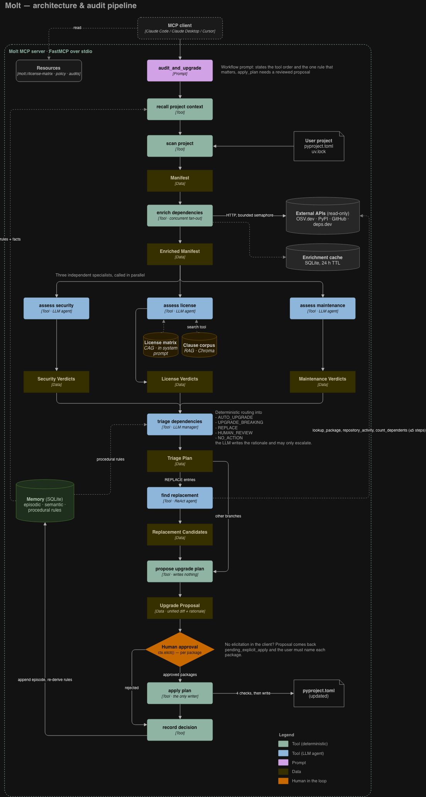

# Molt


## Project Overview

Molt helps developers audit their Python projects.
As software projects grow, security vulnerabilities, license compatibility and maintenance health become harder to manager.
Add Molt to your AI harness to create a security and compliance expert to your development team. 
It will screen your project dependencies for vulnerabilities, maintenance and license issues, propose a mitigation plan and - if approved - execute on it.

## Demo

🎥 [Watch Demo Video](https://youtu.be/CsGXHCwrbA8) — a ~3 minute walkthrough of a full audit of `demo/legacy-app`,

## Architecture & System Design

Molt is one MCP server, exposed over stdio, that an MCP client (Claude Code, Claude Desktop, Cursor)
drives. The diagram below shows the audit pipeline the `audit_and_upgrade` prompt asks the client to run.



**Structure.** The code is organised in layers that only depend downwards. `src/server.py` creates a
FastMCP app and registers three routers (`src/routers/`): tools, prompts and resources. The routers are
thin adapters: they log, fetch collaborators from `src/di.py` and call a plain async function in
`src/tools/` that knows nothing about MCP. Those functions receive everything they need (an HTTP session,
a chat model, a retriever, a store, a clock) as arguments. That is why `tests/test_pipeline.py` can run
the whole audit with fakes, no network and no API key. Below the tools sit the LLM agents
(`src/agents/`, with prompts as data in `src/prompts/`), the read-only API clients (`src/clients/`), the
knowledge sources (`src/resources/`, `src/rag/`) and persistence (`src/memory/`, `src/cache.py`).

**Data flow.** `scan_project` turns `pyproject.toml` and `uv.lock` into a `Manifest`.
`enrich_dependencies` fans out over every package and queries OSV.dev, PyPI and GitHub concurrently
behind a bounded semaphore, caching results in SQLite for 24 hours. Three independent specialist agents
then give verdicts on security, license and maintenance for each package, and the client calls them in
parallel. `triage_dependencies` is a manager over those specialists. Routing into `AUTO_UPGRADE`,
`UPGRADE_BREAKING`, `REPLACE`, `HUMAN_REVIEW` or `NO_ACTION` is deterministic; the LLM writes the
rationale and may only escalate to human review. `REPLACE` entries go to `find_replacement`, a ReAct loop
of at most five steps that has to look up every candidate it suggests. `propose_upgrade_plan` renders a
unified diff, stores it and asks for approval through `ctx.elicit()`, with one required approve/reject
field per package. `apply_plan` is the only tool that writes to disk. Before it writes, it checks that
the proposal exists, has not been applied yet, that every package was approved, and that the file hash
still matches the one the diff was computed from. Every decision is saved by `record_decision`.

**Integration patterns.** The tools are the building blocks and the prompts are the workflows.
`audit_and_upgrade` runs the full pipeline, and `license_check` combines the same tools into a smaller
flow. Resources (`molt://license-matrix`, `molt://policy/{project}`, `molt://audits/{project}/latest`)
make Molt's knowledge and memory readable without calling a model. `assess_license` uses both
retrieval patterns on purpose. The small compatibility matrix is placed in the system prompt as-is
(CAG), and the long license texts are searched on demand (RAG, Chroma or TF-IDF). Memory has three
stores: an episodic log of decisions, semantic package facts, and procedural rules that are re-derived
from the log after every decision. As a result, every rule can name the decisions it came from.

**Key design decisions.** 
- Every agent returns a draft that is checked against the
facts it was given. Corrections are recorded rather than silently applied, so hallucinations become
measurable in the evals. 
- The license matrix, the maintenance thresholds and the
triage router set a minimum. An agent may be stricter, but never more lenient, because wrongly clearing
a GPL dependency costs far more than a false alarm. 
- Version distances, dates and SPDX normalisation are computed in code before the model sees them. 
- The human-in-the-loop guarantee is built into the structure, not just requested in a prompt. Clients without
elicitation get a `pending_explicit_apply` proposal and have to name the packages explicitly.

**External dependencies.** OSV.dev, the PyPI JSON API, the GitHub REST API and deps.dev, all read-only
and free, with no API keys required. Unauthenticated GitHub requests are rate-limited to 60 per hour,
which is the practical ceiling on uncached audits. Any LangChain-supported chat model can
be used, configured per tool, so `ollama:llama3.1` runs Molt fully locally.

**Scalability and performance.** Enrichment is the only step that depends on the network. It is
concurrent, bounded (so it stays polite to free APIs) and cached, which makes a repeat audit mostly
local. The specialists assess each package independently, so they can run in parallel and scale
linearly with the number of dependencies. Only the triage step needs to see the whole project at once.
State is a single SQLite file in `~/.molt/`, which fits a developer tool running locally. A
multi-user deployment would swap the stores behind their existing interfaces.

## Project Structure

```
src/
  server.py            wires three routers onto FastMCP; decides nothing
  routers/             the MCP surface — tools, prompts, resources, elicitation
  tools/               one file per tool; each is a plain async function
  agents/              LLM agent construction + how a package is rendered into a prompt
  prompts/             system prompts and templates, as data
  clients/             OSV, PyPI, GitHub, deps.dev — one class each, all read-only
  domain/models.py     every Pydantic type the server speaks
  resources/           the license compatibility matrix (CAG) and SPDX resolution
  rag/                 the clause corpus, two retrievers, and the agent tool
  memory/              SQLite stores + the procedural-rule derivation
  manifest.py          reading and rewriting the file the user actually edits
  http_client.py       the session abstraction: bounded, polite, meterable
  cache.py             the 24h enrichment cache
  config/, di.py       settings and the process-wide singletons
```

### Dataset Sources

Molt ships no downloaded datasets. It uses two small, hand-curated knowledge sets and four live APIs.

| Source | Where | Format | Used for |
|---|---|---|---|
| License compatibility matrix (58 rules) | `src/resources/license_matrix.py` | Python data, served as JSON at `molt://license-matrix` | CAG: the license verdict floor |
| SPDX clause corpus (16 clause excerpts, 14 licenses) | `src/rag/corpus.py` | Python data, indexed into Chroma at `~/.molt/chroma` on first use | RAG: citing the clause behind a verdict |
| OSV.dev, PyPI JSON API, GitHub REST API, deps.dev | `src/clients/` | JSON over HTTPS, free, no key | Enrichment and replacement lookup |
| Eval datasets | `tests/evals/*/dataset.py` | Python cases with expected verdicts | Grading the agents |

Clause texts are excerpts from the licenses' own texts as published by [SPDX](https://spdx.org/licenses/).
Adding a passage to `CLAUSES` is enough to make it retrievable, with no preprocessing step.

## Features

### Mandatory Features

**1. MCP Server Built in Python using FastMCP**
- `src/server.py` creates the `FastMCP` app and registers three routers from `src/routers/`: 11 tools,
  2 prompts and 3 resources, served over stdio.

**2. At Least 1 MCP Tool**
- 11 tools, one file each in `src/tools/`, registered in `src/routers/tools.py`:
  `scan_project`, `enrich_dependencies`, `assess_security`, `assess_license`, `assess_maintenance`,
  `triage_dependencies`, `find_replacement`, `propose_upgrade_plan`, `apply_plan`,
  `recall_project_context`, `record_decision`. Each is also usable on its own.

**3. At Least 1 MCP Prompt with User Feedback Workflow**
- `audit_and_upgrade` (`src/routers/prompts.py`, text in `src/prompts/workflows.py`) runs the full audit.
  The feedback step is in `propose_upgrade_plan`: it asks for approval of each package via `ctx.elicit()`
  (`src/routers/elicitation.py`), and `apply_plan` only writes the packages the user approved.
- `license_check` is a shorter workflow in which the user resolves each license finding in conversation.

### Custom Features

**1. Workflow patterns (sequential, parallel, conditional)**
- **Description:** Combine at least two distinct workflow patterns.
- **Implementation:** *Sequential:* the order in `src/prompts/workflows.py`. *Parallel:* concurrent
  fan-out in `src/tools/enrich_dependencies.py`, plus the three assessors running at once.
  *Conditional:* `src/tools/triage_dependencies.py` routes each package into one of five branches.

**2. Advanced agentic patterns (ReAct, agents-as-tools with a manager)**
- **Description:** Use at least one advanced agentic pattern.
- **Implementation:** *ReAct:* `src/agents/replacement_agent.py`, a loop of at most 5 steps that must
  look up every candidate it suggests. *Agents as tools:* `src/agents/{security,license,maintenance}_agent.py`,
  with `src/agents/triage_agent.py` as the manager.

**3. CAG**
- **Description:** Put static, authoritative context directly into the prompt.
- **Implementation:** `src/resources/license_matrix.py` is added in full to the license agent's
  system prompt (`src/prompts/assess_license.py`). It is small enough that retrieving from it would only
  add a way to fail.

**4. RAG**
- **Description:** Retrieve relevant passages to ground the model's answers.
- **Implementation:** `src/rag/`: clause-level chunks, a Chroma retriever and a TF-IDF retriever, exposed
  to the license agent as the `search_license_text` tool. Switch between them with
  `MOLT_SERVER_RAG_BACKEND=chroma|lexical|off`.

**5. Long-term memory (semantic, episodic, procedural)**
- **Description:** Persist at least three kinds of memory across sessions.
- **Implementation:** `src/memory/store.py` (SQLite) holds all three. Procedural rules are re-derived
  from the episodic log in `src/memory/procedural.py`. Read them back via `recall_project_context` or
  `molt://policy/{project}`.

**6. Human in the loop: AI generation → validation**
- **Description:** A human validates AI-generated output before it takes effect, enforced by the
  system rather than by prompt text.
- **Implementation:** `src/tools/propose_upgrade_plan.py` produces a diff and writes nothing.
  `src/tools/apply_plan.py`, the only tool that writes, checks the proposal ID, the approvals and the
  file hash before writing.

## Setup Instructions

### Prerequisites

- Python 3.14 or higher
- [uv](https://github.com/astral-sh/uv) for dependency management

### Installation

1. Clone the repository:
   ```bash
   git clone https://github.com/MaxHoefl/molt.git
   cd molt
   ```

2. Install dependencies using `uv`:
   ```bash
   uv sync
   ```

3. Set up environment variables:
   - Copy `template.env` to `local.env`:
     ```bash
     cp template.env local.env
     ```
   - Fill in the required API keys and configuration values (see [Environment Variables](#environment-variables) section below).

### Environment Variables

Molt reads `MOLT_SERVER_*` settings from `<repo>/local.env` (the name follows
`MOLT_SERVER_ENVIRONMENT`, which defaults to `local`). `template.env` documents every option. The ones
you are most likely to change:

```bash
MOLT_SERVER_DEFAULT_LLM_MODEL="anthropic:claude-opus-5"   # any "<provider>:<model>", e.g. ollama:llama3.1
MOLT_SERVER_ASSESS_LICENSE_LLM_MODEL="openai:gpt-5.5"      # per-tool override (optional)
MOLT_SERVER_RAG_BACKEND="chroma"                           # chroma | lexical | off
```

The provider key has to be in the server's process environment: export it in your shell, or put it in
the `env` block of the client config below. Get an Anthropic key at https://platform.claude.com/settings/keys.

```bash
export ANTHROPIC_API_KEY=sk-ant-...
```

## Running the Server

### As a Command-Line Tool

To start the MCP server locally:

```bash
uv run python -m src.server
```

### Example Queries

Try these in a connected client. `demo/legacy-app` is a small project with known problems.

```text
# Full workflow (prompt): scan → assess → triage → proposal → your approval → apply
/mcp__molt__audit_and_upgrade /abs/path/to/molt/demo/legacy-app binary

# License-only workflow (prompt), with no file changes
/mcp__molt__license_check /abs/path/to/molt/demo/legacy-app binary

# Individual tools, in plain language
"Use molt to scan /abs/path/to/molt/demo/legacy-app and enrich its dependencies."
"Assess the maintenance health of nose 1.3.7."
"Find a maintained replacement for nose; we use it as a test runner."
"Is chardet 4.0.0 OK to ship in a closed-source binary for an MIT project?"

# Resources, with no model involved
molt://license-matrix
molt://policy//abs/path/to/molt/demo/legacy-app
molt://audits//abs/path/to/molt/demo/legacy-app/latest
```

To call tools by hand without a model, use the MCP Inspector:

```bash
uv run fastmcp dev src/server.py
```

### Other Commands

```bash
# Compare the two retrievers on a query (see the README's RAG section)
uv run python -c "from src.rag.retrieval import LexicalRetriever; print([p.id for p in LexicalRetriever().search('relink a modified library', 2)])"

# Reset all state (enrichment cache + memory + vector index); it rebuilds on the next run
rm -rf ~/.molt
```

### Connecting from an MCP Client

**Claude Code**, run from the directory you want to audit:

```bash
claude mcp add molt -e ANTHROPIC_API_KEY=$ANTHROPIC_API_KEY -- uv --directory /abs/path/to/molt run python -m src.server
```

**Claude Desktop / Cursor** (`claude_desktop_config.json` or `.cursor/mcp.json`):

```json
{
  "mcpServers": {
    "molt": {
      "command": "uv",
      "args": ["--directory", "/abs/path/to/molt", "run", "python", "-m", "src.server"],
      "env": { "MOLT_SERVER_ENVIRONMENT": "local", "ANTHROPIC_API_KEY": "sk-ant-..." }
    }
  }
}
```

Claude Desktop supports elicitation and shows an approval form. Claude Code does not, so the proposal
comes back as `pending_explicit_apply` and you name the approved packages in the chat.

## Testing

Unit tests run offline in seconds with the model stubbed. Evals call a real model and grade its judgment
(see `tests/evals/README.md`).

```bash
uv run pytest
uv run pytest tests/tools -q
uv run pytest -m eval                          # run every eval, one test per case (costs tokens)
uv run python -m tests.evals.triage.runner     # run an eval and output a scorecard (suitable for model comparison)
# replace "triage" with: security, license, maintenance, replacement
```

Comparing two models takes one env var and a diff:
```
MOLT_SERVER_ASSESS_LICENSE_LLM_MODEL="anthropic:claude-opus-5" uv run python -m tests.evals.license.runner > opus.txt
MOLT_SERVER_ASSESS_LICENSE_LLM_MODEL="ollama:llama3.1"         uv run python -m tests.evals.license.runner > llama.txt
diff opus.txt llama.txt
```

## Troubleshooting

### Issue: every agentic tool fails with an authentication error
**Solution:** The provider key isn't in the server's environment. Pass it in the client config's `env`
block, or export it before starting the client.

### Issue: `400 - temperature is deprecated for this model`
**Solution:** Remove `MOLT_SERVER_*_LLM_TEMPERATURE` from your env file. Reasoning models reject it.

### Issue: `No uv.lock file found`
**Solution:** Only uv projects are supported for now. Run `uv lock` in the target project first.

### Issue: `repo_health` is empty and `errors` mention GitHub
**Solution:** You've hit the unauthenticated GitHub rate limit (60 requests/hour). Wait an hour and re-run.

### Issue: the first license assessment is slow
**Solution:** Chroma downloads an ~80 MB embedding model on first use. Set `MOLT_SERVER_RAG_BACKEND=lexical`
to avoid it.

## License

This project is licensed under the MIT License - see the LICENSE file for details.